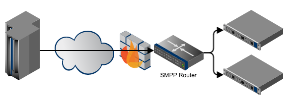

SMPP Router
===========

The [SMPP Router](http://www.moiji-mobile.com/smpp-router) was created out
of the necessary to easily split traffic and patch messages to make-up
for limitations in proprietary SMSCs. It is using the
[smpp-codec](https://github.com/moiji-mobile/smpp-codec) library and can
route by matching the system\_id, dest\_addr and source\_addr with an
exact match or with a regular expression. Alternatively a database look-up
can be made to determine the next hop.

The system handles fail-over by allowing multiple connections per system\_id
and is prepared for load-balancing scenarious as well. The design document
can be found in the [doc/](doc/) directory and a rendered PDF can be downloaded
[here](https://www.moiji-mobile.com/wp-content/uploads/2016/09/smpp-router-v1.pdf).

